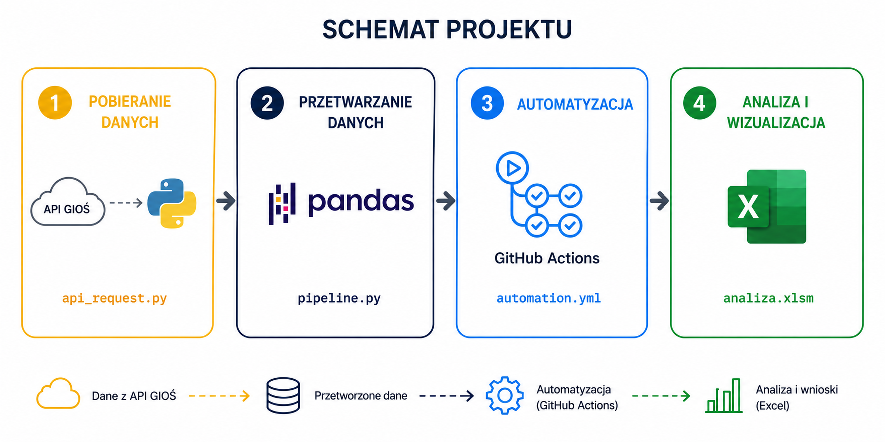
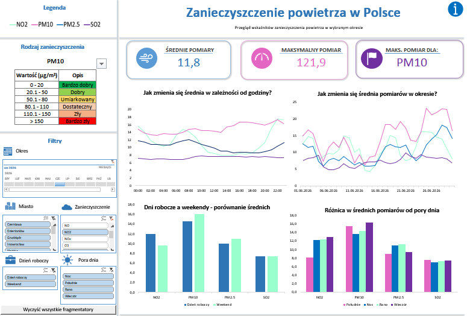

# 💨 GIOŚ - analiza jakości powietrza

## 🔎 Wstęp

Niniejsze repozytorium zawiera projekt dotyczący pobierania, przetwarzania oraz analizy danych z API Głównego Inspektoratu Ochrony Środowiska (GIOŚ). Projekt składa się z czterech głównych etapów:

- **Krok 1:** Pobieranie danych pomiarowych z [API GIOŚ](https://api.gios.gov.pl/pjp-api/swagger-ui/index.html) przy użyciu skryptu Pythona - [api_request.py](pliki_python/api_request.py).

- **Krok 2:** Czyszczenie danych oraz zapis do plików CSV z wykorzystaniem biblioteki Pandas - [pipeline.py](pliki_python/pipeline.py).

- **Krok 3:** Automatyzacja procesu za pomocą GitHub Actions z wykorzystaniem pliku [automation.yml](.github/workflows/automation.yml).

- **Krok 4:** Analiza i wizualizacja danych w Excelu - [analiza.xlsm](analiza.xlsm).

Projekt umożliwia automatyczne pobieranie danych z API, ich czyszczenie i usuwanie duplikatów, zapis w repozytorium z wykorzystaniem GitHub Actions oraz automatyczne odświeżanie danych w Excelu przy użyciu Power Query.

**Źródło danych:** [GIOŚ - EKOINFONET](https://powietrze.gios.gov.pl/pjp/content/api)

**Uwaga:** Opis wykorzystanych w projekcie zanieczyszczeń powietrza można znaleźć [tutaj](dane/dane.md). 

## 🧱 Schemat repozytorium

| Folder / Plik | Opis |
|----------------|-------------|
| **.github/workflows** | Pliki workflow GitHub Actions odpowiedzialne za automatyczne uruchamianie skryptu [pipeline.py](pliki_python/pipeline.py) |
| **dane/** | Dane źródłowe zapisane w formacie CSV |
| **pliki_python/** | Skrypty Pythona pozwalające na pobranie i przetwarzanie danych |
| **screeny/** | Zrzuty ekranu przedstawiające projekt |
| **.gitignore** | Lista plików i folderów ignorowanych przez Git |
| **analiza.xlsm** | Plik Excel zawierający analizę danych z wykorzystaniem Power Query, tabel przestawnych, wykresów, fragmentatorów, Power Pivot oraz makr VBA |
| **opis_projektu.pptx** | Szczegółowy opis projektu w formie prezentacji |
| **README.md** | Opis repozytorium |
| **requirements.txt** | Lista bibliotek Pythona wymaganych do uruchomienia projektu oraz workflow GitHub Actions |

## 📊 Wizualizacja

Powyższy dashboard umożliwia analizę oraz wizualizację wcześniej pobranych i przetworzonych danych. Dashboard zawiera wykresy oraz wskaźniki KPI z informacjami o średnich wartościach pomiarów w zależności od godziny, wybranego miesiąca, rodzaju dnia (dzień roboczy lub weekend) oraz pory dnia (np. rano, wieczorem). Wszystkie elementy dashboardu można filtrować za pomocą fragmentatorów znajdujących się po lewej stronie. Fragmentatory można wyczyścić za pomocą przycisku wykorzystujący makro VBA (użyty kod VBA znajduje się [tutaj](dane/kod_vba.md)). 

Plik z dashboardem można pobrać [tutaj](analiza.xlsm).

## 💡 Wnioski - czerwiec 2026

- Średnia wartość pomiarów w czerwcu 2026 r. wyniosła 11,8 µg/m³.
- Maksymalna zarejestrowana wartość wyniosła 121,9 µg/m³ dla pyłu PM10, co odpowiada złej jakości powietrza. PM10 jest zanieczyszczeniem negatywnie wpływającym na układ oddechowy.
- Od połowy miesiąca można zaobserwować stopniowy wzrost wartości pomiarów.
- Średnie wartości dla NO2, PM10, PM2.5 oraz SO2 utrzymywały się na poziomie odpowiadającym kategoriom „Bardzo dobry” lub „Dobry”.
- N02 osiąga najniższe wartości w południe, PM10 najwyższe w południe i wieczorem, PM2.5 nocą i wieczorem, a SO2 utrzymuje zbliżone wartości na poziomie około 8 µg/m³ o każdej porze dnia. Niemniej, różnice pomiędzy wartościami w tym zakresie dla NO2, PM10 i PM2.5 są niewielkie.
- Dla zanieczyszczenia PM10 średnie pomiary nieznacznie wzrastają wraz z upływem dnia. Największym zróżnicowaniem i wahaniem w zależności od godziny wyróżnia się NO2.
- Dla zanieczyszczenia PM10 i PM2.5 średnie wartości pomiarów są nieznacznie większe w weekendy niż w dni robocze, z kolei dla NO2 zależnośc jest odwrotna. SO2 osiąga zbliżone wartości na poziomie około 7 µg/m³ niezależnie od rodzajów dnia. Różnice pomiędzy poszczególnymi dniami są jednak niewielkie.

## 🖥️ Szczegóły techniczne
- **Narzędzia wykorzystane w projekcie:** 
    - Python
    - Pandas
    - GitHub Actions
    - Excel
    - Power Query
    - Power Pivot
    - PowerPoint 
    
- **Źródło danych:** [Główny Inspektorat Ochrony Środowiska](https://powietrze.gios.gov.pl/pjp/current) 
    - Link do API: https://api.gios.gov.pl/pjp-api/swagger-ui/index.html
    - Dokumentacja API: https://powietrze.gios.gov.pl/pjp/content/api
    - Opis zanieczyszczeń: 
        - https://airly.org/pl/pyl-zawieszony-czym-jest-pm10-a-czym-pm2-5-aerozole-atmosferyczne/
        - https://www.iqair.com/pl/newsroom/nitrogen-dioxide
        - https://smoglab.pl/dwutlenek-siarki-w-polsce-zle-na-balkanach-gorzej-czym-truje-nas-smog-4/
        - https://powietrze.gios.gov.pl/pjp/content/show/1000577

## ✒️ Autor

- **Autor:** Mateusz Bochenek
- **E-mail:** matbochenek42@gmail.com
- **Profil GitHub:** https://github.com/matbochenek42
- **Profil LeetCode:** https://leetcode.com/u/SmO7BWmsiz/