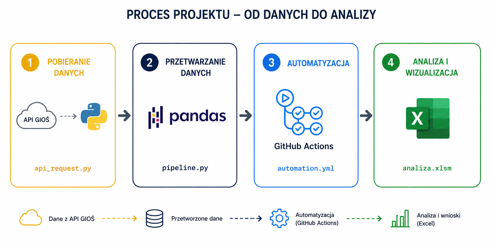

# 💨 GIOŚ - analiza jakości powietrza

## 🔎 Intro

Niniejsze repozytorium skupia się na projekcie przetwarzania i analizy danych z API Głównego Inspektoriatu Ochrony Środowiska. Projekt ten dzieli się na cztery główne elementy:

- **Krok 1:** Pobranie cogodzinnych danych ze strony [powietrze.gios.gov.pl](https://powietrze.gios.gov.pl/pjp/content/api) przy użyciu skryptu Pythona - [api_request.py](pliki_python/api_request.py).

- **Krok 2:** Czyszczenie i zapis danych do plików CSV w Pandas w pliku [pipeline.py](pliki_python/pipeline.py).

- **Krok 3:** Automatyzacja pliku [pipeline.py](pliki_python/pipeline.py) w Github Actions za pomocą pliku [automation.yml](.github\workflows/automation.yml) (co 8 godzin).

- **Krok 4:** Analiza i wizualizacja danych w Excelu - [analiza.xlsm](analiza.xlsm).

Pozwala to na automatyczne pobieranie danych za pomocą API (wraz z usuwaniem duplikatów i czyszczeniem danych), zapis na chmurze (Github Actions) i automatycznym pobieraniem tych danych w Excelu (Power Query).

**Źródło danych:** [GIOŚ - EKOINFONET](https://powietrze.gios.gov.pl/pjp/content/api)

**Uwaga:** informacje o danych (rodzaje zanieczyszczenia powietrza) wykorzystanych w projekcie znajdziesz [tutaj](dane/dane.md). 

## 🧱 Schemat repozytorium

| Folder / Plik | Opis |
|----------------|-------------|
| **.github/workflows** | Folder w którym znajduje się skrypt w formacie .yml automatyzujący plik [pipeline.py](pliki_python/pipeline.py) pobierający dane w Github Actions |
| **dane/** | Dane źródłowe pobierane w formacie CSV |
| **pliki_python/** | Skrypty Pythona pozwalające na pobranie i czyszczenie danych |
| **screeny/** | Screeny projektu |
| **.gitignore** | Nazwy plików zignorowanych w udostępnionym projekcie|
| **analiza.xlsm** | Plik Excel, w którym za pomocą Power Query pobierane są dane w celu finałowej analizy. Użyto tabel przestawnych, wykresów, fragmentatorów, makra (VBA) i Power Pivot |
| **opis_projektu.pptx** | Szczegółowy opis repozytorium w postaci prezentacji |
| **README.md** | Opis repozytorium |
| **requirements.txt** | Plik zawierający dodatkowe biblioteki Pythona, które Github musi pobrać w celu automatyzacji pliku [pipeline.py](pliki_python/pipeline.py) |

## 📊 Wizualizacja

Dashboard możesz zobaczyć i pobrać [tutaj](analiza.xlsm)

## 💡 Wnioski

## 🖥️ Szczegóły techniczne
- **Narzędzia wykorzystane w projekcie:** 
    - Python
    - Pandas
    - Github Actions 
    - Power Query
    - Excel
- **Źródło danych:** [Generalny Inspektoriat Ochrony Środowiska](https://powietrze.gios.gov.pl/pjp/current) 
    - Link do API: https://api.gios.gov.pl/pjp-api/swagger-ui/index.html
    - Dokumentacja API: https://powietrze.gios.gov.pl/pjp/content/api
    - Dodatkowe źródła opisu danych: 
        - https://airly.org/pl/pyl-zawieszony-czym-jest-pm10-a-czym-pm2-5-aerozole-atmosferyczne/
        - https://www.iqair.com/pl/newsroom/nitrogen-dioxide
        - https://smoglab.pl/dwutlenek-siarki-w-polsce-zle-na-balkanach-gorzej-czym-truje-nas-smog-4/
        - https://powietrze.gios.gov.pl/pjp/content/show/1000577

## ✒️ Autor

- **Autor:** Mateusz Bochenek
- **E-mail:** matbochenek42@gmail.com
- **Profil GitHub:** https://github.com/matbochenek42
- **Profil LeetCode:** https://leetcode.com/u/SmO7BWmsiz/